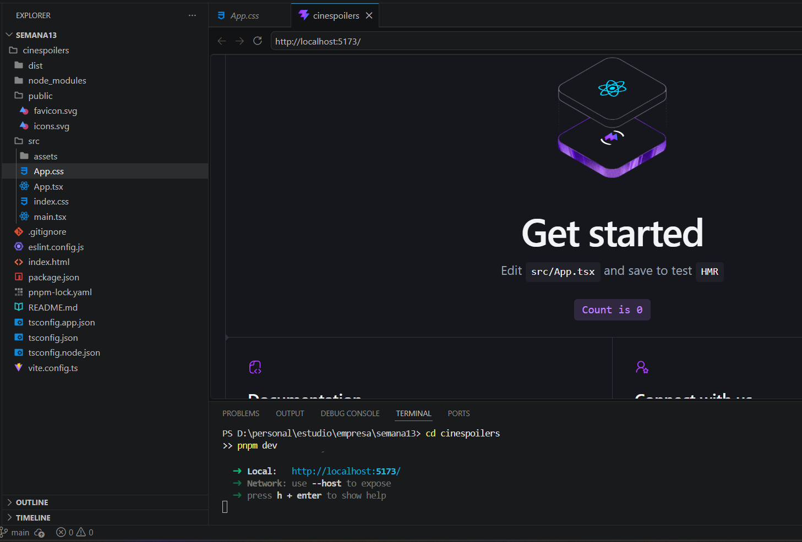
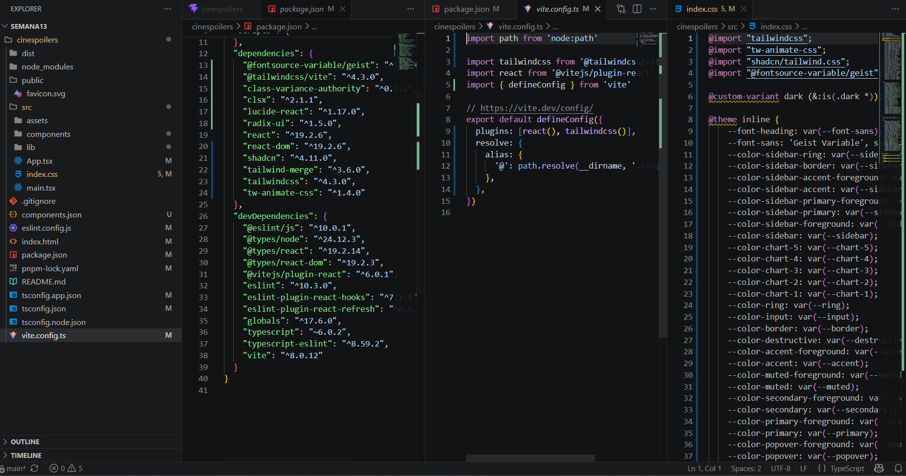
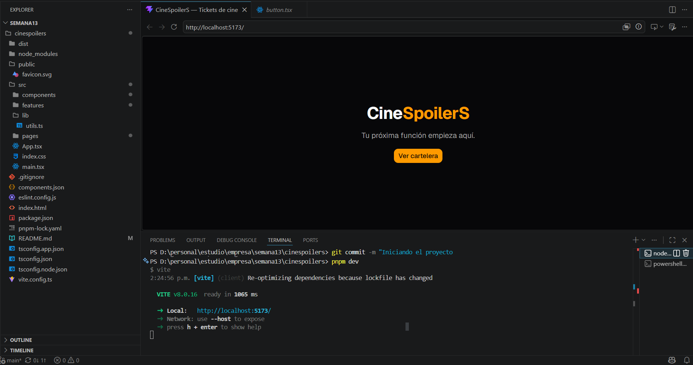
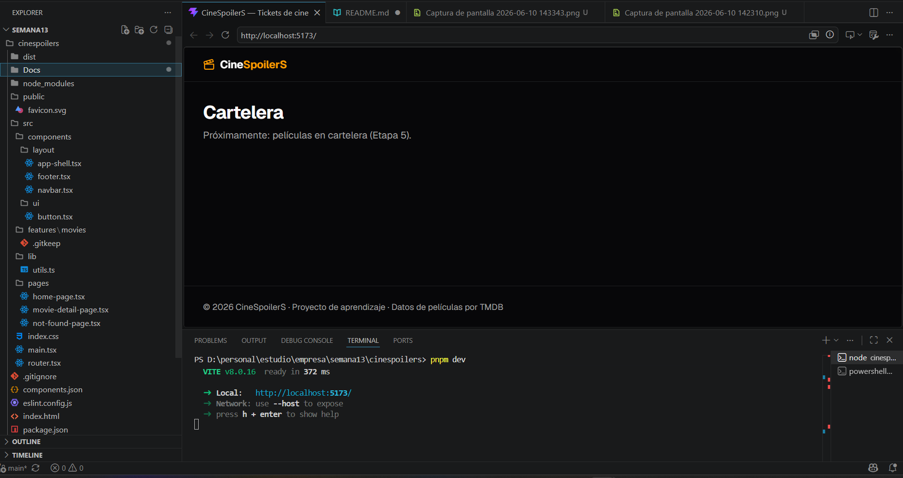

## Evidencias de Laboratorio 13

### Integrante: Haro Vargas Gabriel
1.-Primera evidencia - Proyecto corriendo:

2.- Segunda evidencia - Instalación de tailwind:

3.- Tercera evidencia - Shadcn y su botón:

4.- Cuarta evidencia - Layout con footer, navbar y appshell:

### Integrante: Oscar OlanO Paniora
1.-Primera evidencia - Proyecto corriendo:

2.- Segunda evidencia - Instalación de tailwind:

3.- Tercera evidencia - Shadcn y su botón:

4.- Cuarta evidencia - Layout con footer, navbar y appshell:

### Integrante:

